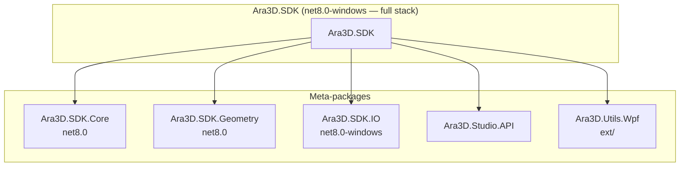
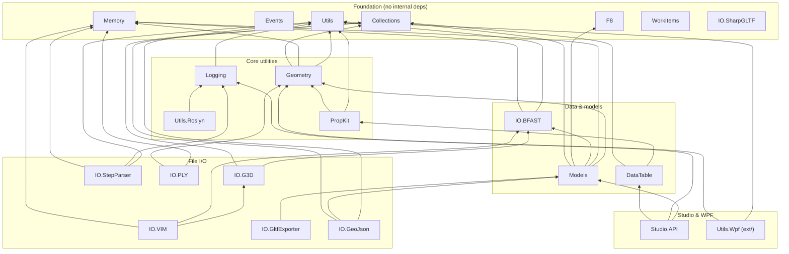
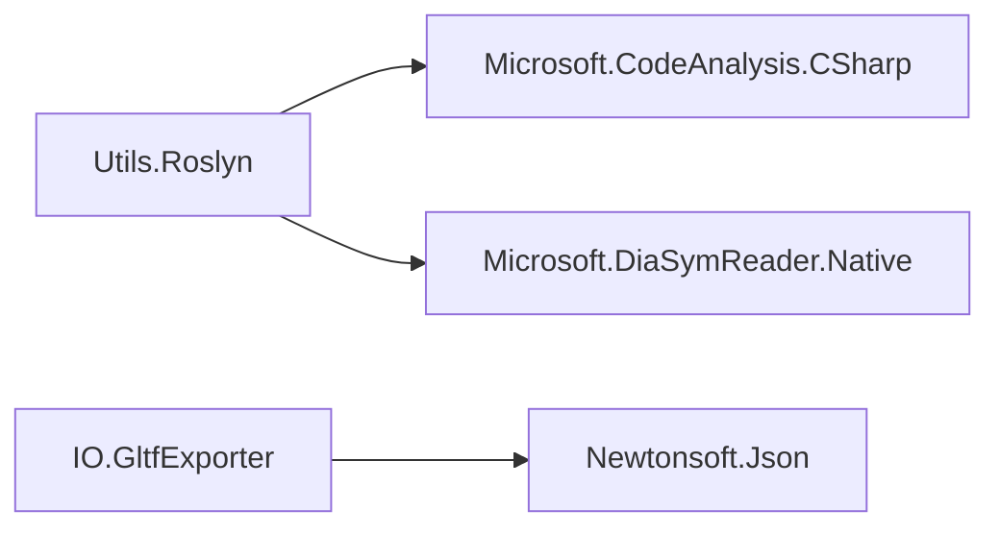

# NuGet package dependencies

Published packages are listed in [`build/packages.txt`](../build/packages.txt). That manifest
includes **`src/` and `ext/` library projects only** — never `toolchain/`, `plugins/`, `apps/`,
or other repo folders. All listed packages share the version in
[`Directory.Build.props`](../Directory.Build.props). Pack with `pack.bat`; see
[`NUGET_RELEASE.md`](NUGET_RELEASE.md).

Arrows in the diagrams below point from a package **to what it depends on**.

## Meta-package hierarchy

Meta-packages are dependency-only bundles (no source of their own). Pick the smallest tier
that fits your app.

| Meta-package | Directly includes |
| --- | --- |
| **Ara3D.SDK.Core** | Collections, DataTable, Events, F8, Logging, Memory, PropKit, Utils, Utils.Roslyn, WorkItems |
| **Ara3D.SDK.Geometry** | Collections, F8, Geometry, Memory, Models, Utils |
| **Ara3D.SDK.IO** | All I/O libraries |
| **Ara3D.SDK** | Core + Geometry + IO + Studio.API + Utils.Wpf |

| Meta-package | TFM | Use when |
| --- | --- | --- |
| [Ara3D.SDK.Core](../src/Ara3D.SDK.Core) | `net8.0` | Minimal cross-platform foundation |
| [Ara3D.SDK.Geometry](../src/Ara3D.SDK.Geometry) | `net8.0` | Meshes, models, SIMD math |
| [Ara3D.SDK.IO](../src/Ara3D.SDK.IO) | `net8.0-windows` | File formats |
| [Ara3D.SDK](../src/Ara3D.SDK) | `net8.0-windows` | Everything above plus Studio API and WPF |

## Library dependency graph

Grouped by layer. **Leaf nodes** (no internal Ara3D dependencies): `Collections`, `Events`,
`F8`, `Memory`, `Utils`, `WorkItems`, `IO.SharpGLTF`.

## External NuGet dependencies

Most libraries have **zero** external NuGet deps. The exceptions:

## Quick reference

| If you need… | Reference |
| --- | --- |
| Minimal cross-platform foundation | `Ara3D.SDK.Core` |
| Meshes, SIMD math, models | `Ara3D.SDK.Geometry` |
| VIM, PLY, glTF, STEP | `Ara3D.SDK.IO` |
| Studio plug-in API | `Ara3D.Studio.API` (or full `Ara3D.SDK`) |
| WPF helpers | `Ara3D.Utils.Wpf` |
| Just one format | Individual package, e.g. `Ara3D.IO.VIM` |

Per-project descriptions: [`src/README.md`](../src/README.md).

## Not published to NuGet

Built locally but excluded from meta-packages and [`build/packages.txt`](../build/packages.txt).
Projects under these folders set `IsPackable=false` (see `toolchain/Directory.Build.props`).

| Folder | Examples | Notes |
| --- | --- | --- |
| [`toolchain/`](../toolchain/) | Build and metrics scripts | Dev tools |
| [`plugins/`](../plugins/) | Bowerbird | Plug-in host |
| [`integrations/`](../integrations/) | Assimp loader | Optional adapters |
| [`wip/`](../wip/) | Domo | Work in progress |
